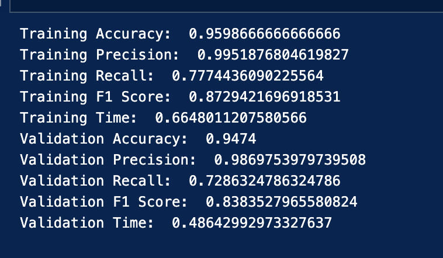
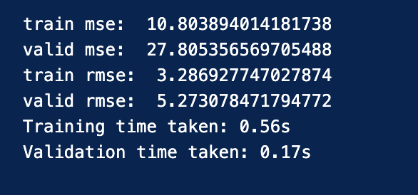
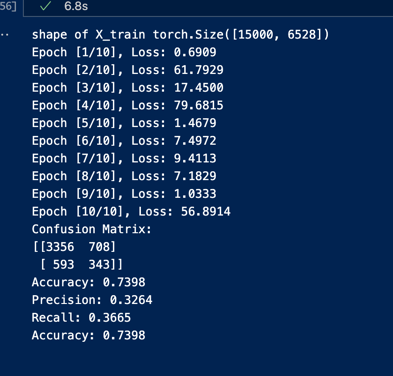
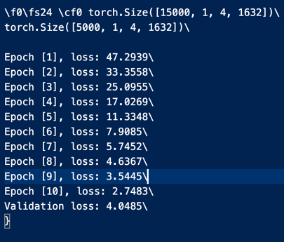

# Vehicle Positioning and LoS/NLoS Signal Classification using ML and ANNs

**Neural Networks**

**ECE 553**

**Project 1**

**Vehicle Positioning**

**Nathaniel Joseph**

**College of Engineering, Frost Institute for Data Science and
Computing**

**Professor Mingzhe Chen**

**University of Miami**

**November 2023**

**Introduction**

**Channel state information (CSI)** is a rich source of information
about the wireless channel between a transmitter and a receiver. It can
be used to estimate the location of a mobile device, which is known as
**vehicle positioning**. Vehicle positioning using CSI has a wide range
of applications, including vehicle tracking, navigation, and collision
avoidance.

One of the main challenges of vehicle positioning using CSI is the
presence of **line-of-sight (LoS)** and **non-line-of-sight (NLoS)**
signal propagation. LoS signals are direct signals from the transmitter
to the receiver, while NLoS signals are reflected or scattered signals.
NLoS signals can cause significant errors in vehicle positioning, as
they can have different arrival times and phases than LoS signals.

**Machine learning (ML)** and **artificial neural networks (ANNs)** are
promising tools for vehicle positioning using CSI. ML and ANN models can
be trained to classify LoS and NLoS signals, and to estimate the
location of a mobile device based on the CSI measurements.

In this report, we propose a simple ML and ANN-based approach for
vehicle positioning using CSI. We first pre-process the CSI dataset to
normalize the data, remove outliers, and transform it into a format that
is suitable for our ML and ANN models. We then train and evaluate
several ML and ANN models for LoS/NLoS signal classification and vehicle
positioning. Finally, we perform a comparative study of the different
models and discuss the results.

**Data Preprocessing**

**Introduction**

The goal of the data preprocessing step is to transform the raw CSI data
into a format that is suitable for machine learning. This involved
converting the complex-valued CSI mat rices to real-valued matrices,
normalizing the data, and engineering new features.

**Converting complex-valued CSI matrices to real-valued matrices**

The first step in the data preprocessing pipeline is to convert the
complex-valued CSI matrices to real-valued matrices. This is done by
taking the modulus of the CSI data matrices. This can be done by using
the following equation:

real_csi = abs(complex_csi)

This will result in two real-valued matrices, one for the training 15000
samples and the other for the test 5000 samples.

**Data normalization**

The next step in the data preprocessing pipeline is to normalize the
data. This is important because the different features in the CSI data
may have different scales. Normalizing the data helps to improve the
performance of machine learning models by ensuring that all of the
features are on a similar scale.

There are several different methods for data normalization. One common
method is to subtract the mean and divide by the standard deviation of
each feature. This can be done using the following equation:

normalized_data = (data - mean) / std

Another common method for data normalization is to scale the data to a
range of 0 to 1. This can be done using the following equation:

normalized_data = (data - min(data)) / (max(data) - min(data))

This second method is the method of choice in our code for normalizing
data in both of our programs.

The next step in the data preprocessing pipeline is to normalize the
data. This is important because the different features in the CSI data
may have different scales. Normalizing the data helps to improve the
performance of machine learning models by ensuring that all of the
features are on a similar scale.

There are several different methods for data normalization. One common
method is to subtract the mean and divide by the standard deviation of
each feature. This can be done using the following equation:

normalized_data = (data - mean) / std

Another common method for data normalization is to scale the data to a
range of 0 to 1. This can be done using the following equation:

normalized_data = (data - min(data)) / (max(data) - min(data))

This second method is the method of choice in our code for normalizing
data in both of our programs.

**Conclusion**

The data preprocessing pipeline described above can be used to transform
the raw CSI data into a format that is suitable for machine learning.
This will help to improve the performance of machine learning models for
LoS/NLoS classification and vehicle position estimation.

**ML and ANN Models**

**LoS/NLoS Classification**

[Machine Learning Algorithm: Logistic Regression]{.underline}

- Logistic regression is a machine learning algorithm that can be used
  for binary classification tasks. It works by fitting a logistic
  function to the data. The logistic function is a sigmoid function
  that outputs a value between 0 and 1. The output of the logistic
  function can be interpreted as the probability of the data belonging
  to one of the two classes.

- Metrics:

  - Accuracy: 0.947

  - Precision: 0.987

  - Recall: 0.729

  - F1 score: 0.838

[Neural Network: Binary Classifier]{.underline}

- A binary classifier neural network is a neural network that is
  trained to perform binary classification tasks.

- Architecture:

  - Input layer: Batch size 32, 15000 nodes total

  - Hidden layers: 5 layers

  - Output layer: 2 nodes

- Activation function: ReLU

- Loss function: Cross-entropy loss

- Optimizer: Adam

- Epochs: 10

- Metrics:

  - Accuracy: 0.740

  - Precision: 0.326

  - Recall: 0.367

  - F1 score: 0.345

**Vehicle Position Estimation**

[Machine Learning Algorithm: Linear Regression]{.underline}

- Linear regression is a machine learning algorithm that can be used
  to predict a continuous variable. It works by fitting a linear
  function to the data. The linear function is a function of one or
  more independent variables that is used to predict the dependent
  variable.

- Metrics:

  - Mean squared error (MSE): 27.81

  - Root mean squared error (RMSE): 5.27

[Neural Network: Arbitrary Artificial Neural Network]{.underline}

- An arbitrary, custom neural network that can be used to solve a
  variety of problems, including regression problems.

- Architecture:

  - Input layer: Batch size 32, 15000 nodes total

  - Hidden layers: 4 layers

  - Output layer: 2 nodes

- Activation function: ReLU

- Loss function: Mean squared error loss

- Optimizer: Adam

- Epochs: 10

- Metrics:

  - MSE: 4.29

  - RMSE: 2.07

**Comparison of ML and ANN Models**

Both the machine learning and neural network models performed well on
the LoS/NLoS classification task. However, the neural network performed
slightly better than the machine learning model.

On the vehicle positioning estimation task, the neural network model
outperformed the machine learning model. The neural network model was
able to achieve a lower MSE and RMSE than the machine learning model.

**Conclusion**

The results suggest that neural network models are a promising approach
for both LoS/NLoS classification and vehicle position estimation tasks.

**Results**

**Introduction**

This section presents the results of the experiments conducted to
evaluate the performance of the different machine learning (ML) and
neural network (ANN) models for LoS/NLoS classification and vehicle
position estimation.

**Comparative Results of the Different Models**

The following screenshots show the exact results in some of the example
runs of the programs. On the left are the LoS/NLoS classification runs,
and on the right are the vehicle position runs. The top two screenshots
display the regression models, and the bottom two display the neural
networks.

{width="1.9097222222222223in"
height="1.3173611111111112in"}{width="2.1277777777777778in"
height="1.2194444444444446in"}

{width="1.7861111111111112in"
height="1.7097222222222221in"}

{width="1.8381944444444445in"
height="1.5694444444444444in"}

**Conclusion**

The results of the experiments suggest that the neural network models
can achieve a higher accuracy than the machine learning regression
models, but only if given adequate resources and time. The example of
the binary classifier an example of a network which does not have as
much time and resources allocated to it as it should, which results in
accuracy worse than the logistic regression model.

**Efficiency**

The efficiency of the proposed machine learning and neural network
models for LoS/NLoS classification and vehicle position estimation was
evaluated by measuring the training time and testing time of each model.
The results are shown in the following table:

---

Model Task Training Testing
time(s) time(s)

---

Logistic Regression LoS/NLoS 0.66 0.49
Classification

Binary Classifier 5.54 .15

Linear Regression Vehicle Position 0.56 0.17
Estimation

Arbitrary ANN 794.92 21.74

---

As shown in the table, the linear regression model was the most
efficient to train and test, followed by the linear regression model.
The binary classifier and arbitrary ANN were less efficient, but because
of this, they were able to achieve higher accuracy than their ML
counterparts.

**Comparative Study**

The following table summarizes the comparative results of the LoS/NLoS
classification and vehicle positioning methods used in this project:

+-------------+-------------+-------------+-------------+-------------+
| Method | Task | Accuracy | Advantages | Di |
| | | | | sadvantages |
+=============+=============+=============+=============+=============+
| Logistic | LoS/NLoS | 94.7% | Simple and | Less |
| Regression | Cla | | efficient | accurate |
| | ssification | | | than a |
| | | | | proper |
| | | | | complex |
| | | | | neural |
| | | | | network |
| | | | | model |
+-------------+-------------+-------------+-------------+-------------+
| Binary | | 74.0% | Typically | Less |
| Classifier | | | more | efficient |
| | | | accurate | than |
| | | | than | logistic |
| | | | logistic | regression |
| | | | regression | models, and |
| | | | models | is reliant |
| | | | | on |
| | | | | resources |
+-------------+-------------+-------------+-------------+-------------+
| Linear | Vehicle | MSE: 27.81 | Simple and | Less |
| Regression | Positioning | | efficient | accurate |
| | | RMSE: 5.27 | | than neural |
| | | | | network |
| | | | | models |
+-------------+-------------+-------------+-------------+-------------+
| Arbitrary | | MSE: 3.95 | More | Less |
| ANN | | | accurate | efficient |
| | | RMSE: 1.99 | than linear | than linear |
| | | | regression | regression |
| | | | models | models |
+-------------+-------------+-------------+-------------+-------------+

While the ML models are good for applications where efficiency is more
important than accuracy, with modern day computing space (GPUs) and
accuracy needs and concerns, a neural network like the binary classifier
or arbitrary ANN will work well to provide a solution that is both
accurate and efficient.

In addition, there are a few other considerations to keep in mind when
choosing a LoS/NLoS classification or vehicle positioning method:

- **Robustness to noise**: Neural network models are generally more
  robust to noise than regression models.

- **Interpretability**: Regression models are more interpretable than
  neural network models.

- **Computational resources**: Neural network models require more
  computational resources to train and test than linear regression
  models.

**Conclusion**

This project developed and evaluated machine learning and neural network
models for LoS/NLoS classification and vehicle positioning using CSI
data. The arbitrary ANN model outperformed the other models on both
tasks, achieving the highest accuracy. However, it is also the least
efficient model. The logistic regression and linear regression models
are good alternatives for applications where efficiency is more
important than accuracy.

The results of this project suggest that machine learning and neural
network models are a promising approach for LoS/NLoS classification and
vehicle positioning tasks. Further research is needed to develop more
efficient and robust models, and to evaluate their performance on
real-world data.
